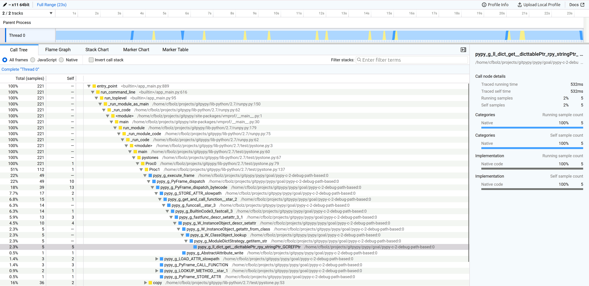

============================================================================
PyPy v7.3.18: release of python 2.7, 3.10 and 3.11 beta, released 2025-02-06
============================================================================

..
     updated to 30e1d327015bf68

The PyPy team is proud to release version 7.3.18 of PyPy.

This release includes a python 3.11 interpreter. We are labelling it "beta"
because it is the first one. In the next release we will drop 3.10 and remove
the "beta" label. There are a particularly large set of bugfixes in this
release thanks to @devdanzin using fusil on the 3.10 builds, originally written
by Victor Stinner. Other significant changes:

- We have updated libffi shipped in our portable builds. We also now statically
  link to libffi where possible which reduces the number of
  shared object dependencies.

- We have added code to be able to show the native function names when
  profiling with VMProf. So far only Linux supports this feature.

- We have added a `PEP 768`_-inspired remote debugging facility. See
  :doc:`remotedebugging`.

- The HPy backend has been updated to latest HPy HEAD

The release includes three different interpreters:

- PyPy2.7, which is an interpreter supporting the syntax and the features of
  Python 2.7 including the stdlib for CPython 2.7.18+ (the ``+`` is for
  backported security updates)

- PyPy3.10, which is an interpreter supporting the syntax and the features of
  Python 3.10, including the stdlib for CPython 3.10.19.

- PyPy3.11, which is an interpreter supporting the syntax and the features of
  Python 3.11, including the stdlib for CPython 3.11.11.

The interpreters are based on much the same codebase, thus the triple
release. This is a micro release, all APIs are compatible with the other 7.3
releases. It follows after 7.3.17 release on August 28, 2024.

We recommend updating. You can find links to download the releases here:

    https://pypy.org/download.html

We would like to thank our donors for the continued support of the PyPy
project. If PyPy is not quite good enough for your needs, we are available for
`direct consulting`_ work. If PyPy is helping you out, we would love to hear
about it and encourage submissions to our blog_ via a pull request
to https://github.com/pypy/pypy.org

We would also like to thank our contributors and encourage new people to join
the project. PyPy has many layers and we need help with all of them: bug fixes,
`PyPy`_ and `RPython`_ documentation improvements, or general `help`_ with
making RPython's JIT even better.

If you are a python library maintainer and use C-extensions, please consider
making a HPy_ / CFFI_ / cppyy_ version of your library that would be performant
on PyPy. In any case, both `cibuildwheel`_ and the `multibuild system`_ support
building wheels for PyPy.

.. _`PyPy`: index.html
.. _`RPython`: https://rpython.readthedocs.org
.. _`help`: project-ideas.html
.. _CFFI: https://cffi.readthedocs.io
.. _cppyy: https://cppyy.readthedocs.io
.. _`multibuild system`: https://github.com/matthew-brett/multibuild
.. _`cibuildwheel`: https://github.com/joerick/cibuildwheel
.. _blog: https://pypy.org/blog
.. _HPy: https://hpyproject.org/
.. _direct consulting: https://www.pypy.org/pypy-sponsors.html

VMProf Native Symbol Names
===========================

When running VMProf profiling with native profiling enabled, PyPy did so far
not produce function names for C functions. The output looked like this::

    pypy -m vmprof ~/projects/gitpypy/lib-python/2.7/test/pystone.py
    Pystone(1.1) time for 50000 passes = 0.0109887
    This machine benchmarks at 4.55011e+06 pystones/second
     vmprof output:
     %:      name:                location:
     100.0%  entry_point          <builtin>/app_main.py:874
     100.0%  run_command_line     <builtin>/app_main.py:601
     100.0%  run_toplevel         <builtin>/app_main.py:93
     100.0%  _run_module_as_main  /home/user/bin/pypy-c-jit-170203-99a72243b541-linux64/lib-python/2.7/runpy.py:150
     100.0%  _run_code            /home/user/bin/pypy-c-jit-170203-99a72243b541-linux64/lib-python/2.7/runpy.py:62
     100.0%  <module>             /home/user/bin/pypy-c-jit-170203-99a72243b541-linux64/site-packages/vmprof/__main__.py:1
     100.0%  main                 /home/user/bin/pypy-c-jit-170203-99a72243b541-linux64/site-packages/vmprof/__main__.py:30
     100.0%  run_path             /home/user/bin/pypy-c-jit-170203-99a72243b541-linux64/lib-python/2.7/runpy.py:238
     100.0%  _run_module_code     /home/user/bin/pypy-c-jit-170203-99a72243b541-linux64/lib-python/2.7/runpy.py:75
     100.0%  <module>             /home/user/projects/gitpypy/lib-python/2.7/test/pystone.py:3
     100.0%  main                 /home/user/projects/gitpypy/lib-python/2.7/test/pystone.py:60
     100.0%  pystones             /home/user/projects/gitpypy/lib-python/2.7/test/pystone.py:67
     100.0%  Proc0                /home/user/projects/gitpypy/lib-python/2.7/test/pystone.py:79
     76.9%   <unknown code>
     69.2%   <unknown code>
     53.8%   <unknown code>
     53.8%   <unknown code>
     46.2%   <unknown code>
     46.2%   <unknown code>
     38.5%   <unknown code>
     38.5%   Proc8                /home/user/projects/gitpypy/lib-python/2.7/test/pystone.py:212
     30.8%   <unknown code>
     ...

We can now symbolify these C functions and give function names and which
shared library they come from, at least on Linux::

    Pystone(1.1) time for 50000 passes = 0.218967
    This machine benchmarks at 228345 pystones/second
     vmprof output:
     %:      name:                                           location:
     100.0%  entry_point                                     <builtin>/app_main.py:889
     100.0%  run_command_line                                <builtin>/app_main.py:616
     100.0%  run_toplevel                                    <builtin>/app_main.py:95
     100.0%  _run_module_as_main                             /home/user/projects/gitpypy/lib-python/2.7/runpy.py:150
     100.0%  _run_code                                       /home/user/projects/gitpypy/lib-python/2.7/runpy.py:62
     100.0%  <module>                                        /home/user/projects/gitpypy/site-packages/vmprof/__main__.py:1
     100.0%  main                                            /home/user/projects/gitpypy/site-packages/vmprof/__main__.py:30
     100.0%  run_module                                      /home/user/projects/gitpypy/lib-python/2.7/runpy.py:179
     100.0%  _run_module_code                                /home/user/projects/gitpypy/lib-python/2.7/runpy.py:75
     100.0%  <module>                                        /home/user/projects/gitpypy/lib-python/2.7/test/pystone.py:3
     100.0%  main                                            /home/user/projects/gitpypy/lib-python/2.7/test/pystone.py:60
     100.0%  pystones                                        /home/user/projects/gitpypy/lib-python/2.7/test/pystone.py:67
     100.0%  Proc0                                           /home/user/projects/gitpypy/lib-python/2.7/test/pystone.py:79
     95.5%   n:pypy_g_execute_frame:0:pypy-c
     91.4%   n:pypy_g_PyFrame_dispatch:0:pypy-c
     63.8%   n:pypy_g_PyFrame_dispatch_bytecode:0:pypy-c
     49.8%   Proc1                                           /home/user/projects/gitpypy/lib-python/2.7/test/pystone.py:137
     17.6%   copy                                            /home/user/projects/gitpypy/lib-python/2.7/test/pystone.py:53
     13.6%   n:pypy_g_PyFrame_CALL_FUNCTION:0:pypy-c
     10.4%   Proc8                                           /home/user/projects/gitpypy/lib-python/2.7/test/pystone.py:212
     8.6%    n:pypy_g_STORE_ATTR_slowpath:0:pypy-c

This becomes even more useful when using the `VMProf Firefox converter`_, which
uses the Firefox Profiler Web UI to visualize profiling output:

.. _`VMProf Firefox converter`: https://github.com/Cskorpion/vmprof-firefox-converter/

What is PyPy?
=============

PyPy is a Python interpreter, a drop-in replacement for CPython
It's fast (`PyPy and CPython`_ performance
comparison) due to its integrated tracing JIT compiler.

We also welcome developers of other `dynamic languages`_ to see what RPython
can do for them.

We provide binary builds for:

* **x86** machines on most common operating systems
  (Linux 32/64 bits, Mac OS 64 bits, Windows 64 bits)

* 64-bit **ARM** machines running Linux (``aarch64``) and macos (``macos_arm64``).

PyPy supports Windows 32-bit, Linux PPC64 big- and little-endian, Linux ARM
32 bit, RISC-V RV64IMAFD Linux, and s390x Linux but does not release binaries.
Please reach out to us if you wish to sponsor binary releases for those
platforms. Downstream packagers provide binary builds for debian, Fedora,
conda, OpenBSD, FreeBSD, Gentoo, and more.

.. _`PyPy and CPython`: https://speed.pypy.org
.. _`dynamic languages`: https://rpython.readthedocs.io/en/latest/examples.html

Changelog
=========

For all versions
----------------
- Update cffi backend to 1.18.0-dev
- Refactor use of Python2 unicode in rpython to use only utf-8. This affects
  windows calls to ``rposix`` routines. Now all the system calls on windows
  should use the ``FunctionW`` variants instead of the ``FunctionA`` ones.
- Update to vmprof-0.4.17
- Update vmprof native profiling to show more native symbols
- Implement `PEP 768`_-inspired remote debugging facility. See
  :doc:`remotedebugging`.
- Add many more int optimization rules.
- Bump ``macosx-version-min`` to 10.13 on 2.7 to match 3.10, 3.11

Bugfixes
~~~~~~~~
- Make sure that tracing tail-recursive infinite recursion ends (:issue:`5021`)
- Revive ``tools/gcdump.py`` which uses ``PYPYLOG``
- Fix ``socket.socket.sendto`` for ``AF_PACKET`` protocol (:issue:`5024`)
- Fix ``inf``/``nan`` formatting with thousands separator (:issue:`5018`)
- Fixup int/long confusion on 32-bit builds
- Fix the ``gc.get_stats`` output to not show incorrect numbers (:issue:`5005`)
- Use simple interactive console if ``stdin`` is closed (:issue:`2981`)
- Use ``HOMEBREW_CELLAR`` to find ``tcl`` library on macOS (:issue:`5096`)
- Don't segfault in unicodedb when looking up invalid codepoints (:issue:`5113`)
- Fix segfault in ``pyexpat`` (:issue:`5112`)
- Guard against list mutation in the list ``repr`` (:issue:`5117`)
- Check input for divide-by-zero in ``__pypy__.intops`` (:issue:`5129`)
- Check input for valid c in ``mulmod(a, b, c)``, ``mod``, and ``floordiv``
  (:issue:`5128`)

Speedups and enhancements
~~~~~~~~~~~~~~~~~~~~~~~~~
- Make the opencoder encoding support varsized ints. This shrinks the memory
  usage of the JIT and is supposed to support really long trace limits without
  recompiling pypy
- Implement a ``try_cast_erased`` function in RPython
- Copy CPython's ``threading`` implementation for windows
- Only use ``largefile`` glibc interfaces on 32-bit build (:issue:`5071`)
- Add a DSL for integer optimizations, use it to create some optimizations, see the blogpost_
- Optimize overflowing ``int*int`` multiplication that produces a ``long`` result
- Resolve names of native functions in vmprof (:issue:`5114`)
- Make internal streamio ``replace_crlf_with_lf`` do only one copy, not two
  since we often read programmatically generated python code.
- Avoid keeping refs on the frame stack when calling functions
- Fix ``reverse`` JIT unrolling, which was done too eagerly
- Write ``abs(int)`` in a branch-free way, producing fewer JIT traces
- On windows, use ``wchar_t`` for ``main(..., argv)``. Solves long standing
  issue around calling ``pypy.exe <unicode-named-file>.py``
- Fix cffi backend for struct-in-a-struct (:issue:`python-cffi/cffi#147`)
- Make ``str.format`` somewhat more jit friendly
- Use ``BCryptGenRandom`` on windows in ``rurandom`` (:issue:`5039`)
- If mode is 0700 in ``mkdir`` on windows, restrict the directory to
  the current user
- Add support for unicode version 14 to RPython

.. _blogpost: https://pypy.org/posts/2024/10/jit-peephole-dsl.html
.. _`PEP 768`: https://peps.python.org/pep-0768/

Python 3.10
-----------

Bugfixes
~~~~~~~~
- Sync ``Python.h`` with upstream, add ``import.h`` (:issue:`5013`)
- Prefer static sysconfigdata if it exists and do not create static
  sysconfigdata on portable builds (:issue:`5015`)
- Fix python2-isms in ``complex``, in both str and format
- Do not segfault in ``reversed.__setstate__`` (:issue:`5029`)
- Fix weird edge case where a ``index`` of a ``memoryview`` releases the
  underlying buffer
- Fix ``_ssl.read`` when ``get_shutdown`` is true, should no longer error
- Always initialize locale by calling ``setlocale(LC_CTYPE, '')``
- Fix when metaclass ``__new__`` has extra args
- Fix ``venv`` when src is a source build
- Also create python.exe and python3.exe when creating a venv in a source build
  on windows
- Sync ``'user_base'`` between ``site.py`` and ``sysconfig.py`` on windows
  (:issue:`5073`)
- Allow unterminated string error to propagate in the tokenizer (:issue:`5076`)
- Fix subtle problem with ``Py_SIZE(PyListObject)`` since it assumes
  ``PyListObject`` is a ``PyVarObject``.
- Fix race in ``Thread.join()`` (:issue:`5080`) and ``threadpool`` stopping (:issue:`4994`)
- Fix logic in packaging ``tklib`` for darwin (:issue:`5082`)
- Fix an infinite loop in the jump threading optimization in the bytecode
  compiler (:issue:`5090`)
- Make ``__doc__`` a proper descr on methods
- Limit ``_string.formatter*`` functions to reject ``bytes`` (:issue:`5111`)
- Remove internal calls of ``utf8(bytes)``, fix error handler, add test
  (:issue:`5110`, :issue:`5111`)
- Make ``linecache.checkcache`` more resilient in the presence of ``__del__`` and multithreading (:issue:`5109`)
- Remove extraneous exports from ``_dbm.__all__`` (:issue:`5115`)
- Add missing ``_ensure_initialized`` in ``_curses.putp`` (:issue:`5116`)
- Check ``self.ssl`` for pathological use of ``_ssl`` (:issue:`5124`)
- Use ``os.fsencode`` for ``dbm.*.open`` (:issue:`5115`)
- Check for NULL ssl certificate (:issue:`5120`)
- Check before calling ``_dealloc_warn_w`` (:issue:`5123`)
- Fix ``_curses`` tests and hide ``_mk_acs`` (:issue:`5122`)
- Use  ``pkg-config`` for cffi ``_tkinter``, fix tk/tcl_path for portable
  builds (:issue:`5064`, :issue:`5096`)
- Test, fix infinite recursion when creating a ``pyobj`` from ``w_obj`` when
  the ``pyobj`` is a list subtype that overrides ``__len__`` in c
- Be more careful in the order of ``StringIO.__init__`` since decoding can fail
  (:issue:`5126`)
- Refactor hashlib ``_keccak_init`` to be a regular class method (:issue:`5127`)
- Fix ``list.pop`` and ``list.insert`` to use ``__index__``
- Check code validity in ``_pickle_support.builtin_code`` (:issue:`5130`)
- Check for bad result when calling ``nl_langinfo`` (:issue:`5132`)
- Backport CPython fix to not write incomplete pyc files
  (:issue:`python/cpython#126606`)
- Do not initialize values if stringio newline is wrong (:issue:`5140`)
- Initialize buffer view ``readonly`` flag properly (:issue:`5136`)
- Only increment ``pos`` in ``PyDict_Next`` after checking len (:issue:`5142`)
- In builtin ``hex(x)``, ``oct(x)``, ``bin(x)``, use ``int.__format__`` not
  ``x.__format__``
- Invalidate the method cache in the presence of overridden mros (:issue:`5149`)
- Fix new failure in ``lib-python/3/test/test_descr`` when ``mro()`` sets
  ``__bases__``
- Avoid segfault when creating memoryview of ctypes array with 0 shape
  (:issue:`5156`)
- Fix signature of ``sendfunc``
- Backport the CPython fixes to ``pyrepl`` to PyPy (:issue:`4990`)
- Fix ``win32console._write`` return value (:issue: `5139`)
- Backport changes to ``site.py`` from CPython3.13 to get pyrepl's
  ``PYTHON_HISTORY`` working

Speedups and enhancements
~~~~~~~~~~~~~~~~~~~~~~~~~
- Move ``_remove_dead_weakref`` to the _weakref module (:issue:`5068`)
- Make ``unicodedata.normalize`` O(1) for ascii strings (:issue:`5052`)
- Add ``PyContextVar_Reset``, ``Py_FatalError`` (:issue:`5081`) (:issue:`5086`)
- Make ``Py_FatalError`` a macro that adds the current function name, like
  CPython
- Many error message tweaks for test compliance with CPython
- Make unmarshaling use ``unrolling_iterable`` instead of a function ptr table,
  which should speed it up slightly.
- Add ``_ssl.keylog_filename`` which is useful for debugging ssl problems
  (:issue:`5141`)
- Allocate less when using ``PyErr_NoMemory`` to raise an error rather than
  segfault
- Add docstrings to tupleobject
- Add audit events to ``syslog`` and ``_sqlite3``
