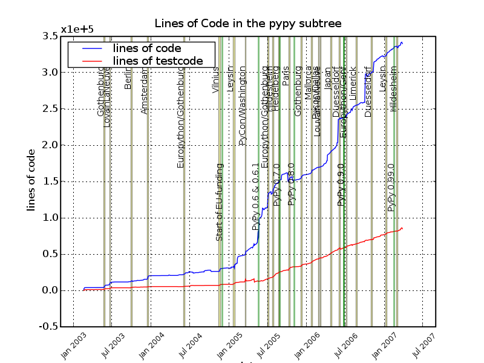
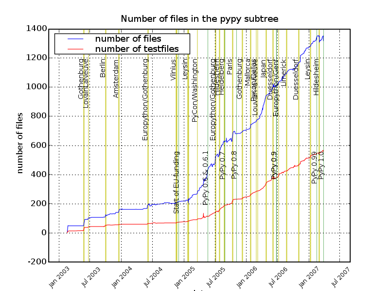
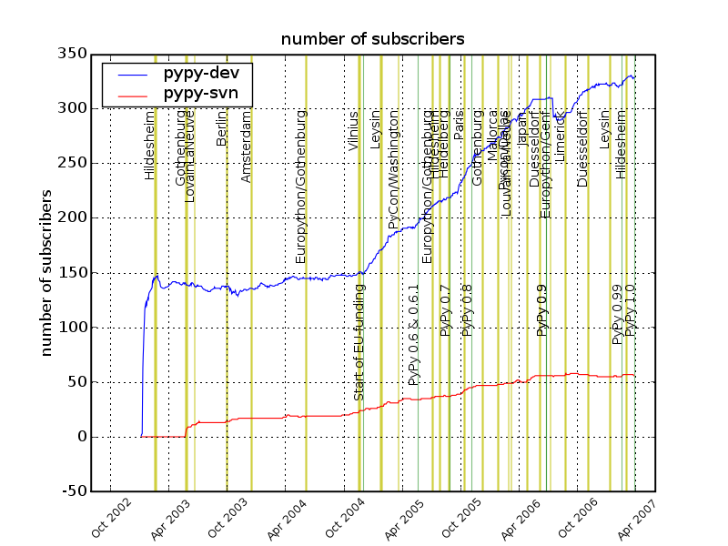
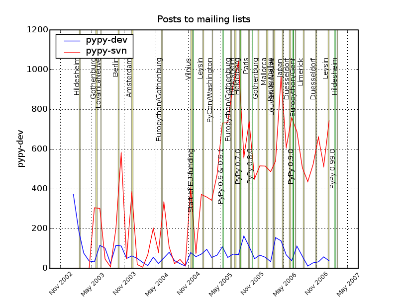
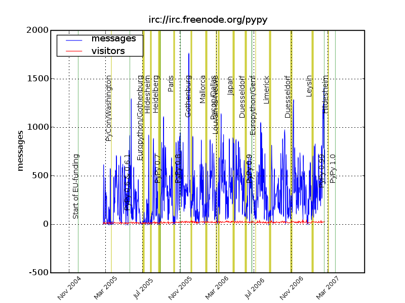
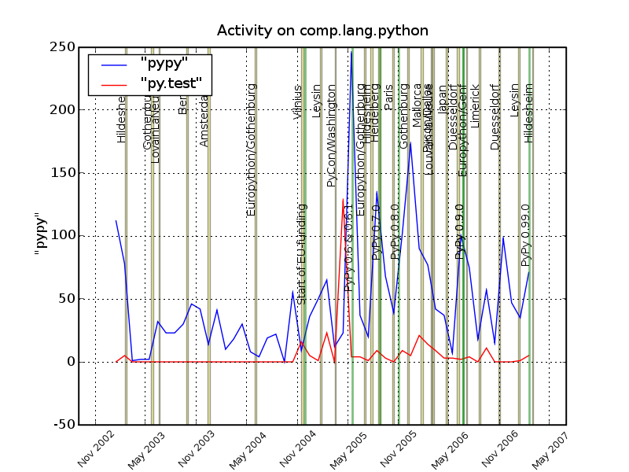
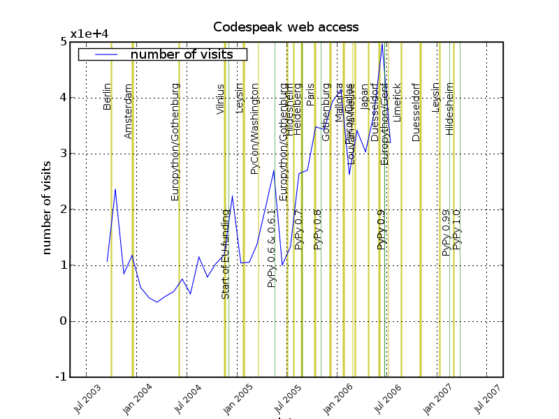

=======================
PyPy Project Statistics
=======================

This page collects some statistics (updated in irregular intervals) about the
PyPy project.

Lines of Code
=============

Lines of code and lines of test code below
the ``pypy/dist/pypy`` tree:

Number of Files
===============

Number of non-test files and the number of test
files below the ``pypy/dist/pypy`` tree:

Subscribers to mailing lists
============================

Number of people subscribed to the `pypy-dev`_ and `pypy-svn`_ mailing lists:

Posts to mailing lists
======================

Number of posts to the `pypy-dev`_ and `pypy-svn`_ mailing lists:

IRC channel activity
====================

Written lines in the #pypy irc channel:

comp.lang.python
================

Mentions of the terms "pypy" and "py.test" on comp.lang.python:

Web access
==========

Page hits to http://codespeak.net/pypy/:

.. _`pypy-dev`: http://python.org/mailman/listinfo/pypy-commit
.. _`pypy-svn`: http://python.org/mailman/listinfo/pypy-dev
